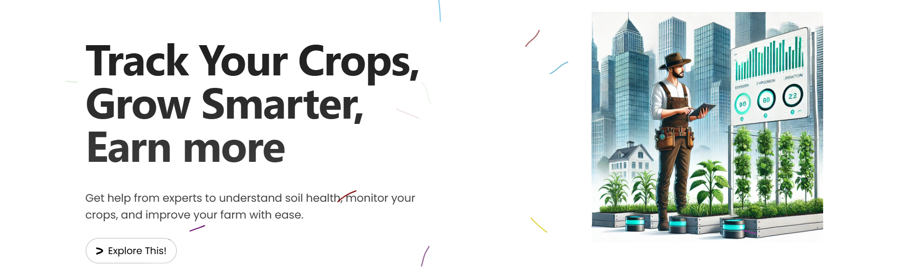

# UrbanKisaan

UrbanKisaan is a React-based Vite application designed to revolutionize urban farming. It provides a powerful dashboard for tracking soil health, monitoring crop growth, accessing educational resources, and connecting with the farming community.

## Features

- **Dashboard**: Centralized platform to monitor soil health, crop growth, and environmental factors.
- **Education**: Access educational resources to enhance your farming knowledge.
- **Marketplace**: Buy and sell produce with ease through a reliable platform.
- **Community Support**: Engage with other farmers and share your experiences.
- **Soil Health Tracking**: Get a comprehensive health score for your plants using real-time data.
- **Responsive Design**: Optimized for mobile, tablet, and desktop devices.

## Screenshots


## Getting Started

Follow these instructions to set up and run the project on your local machine.

### Prerequisites

Ensure you have the following installed:

- Node.js (v14 or later)
- npm (v6 or later) or yarn (v1.22 or later)

### Installation

1. Clone the repository:
   ```bash
   git clone https://github.com/your-username/UrbanKisaan.git
   ```
2. Navigate to the project directory:
   ```bash
   cd UrbanKisaan
   ```
3. Install dependencies:
   ```bash
   npm install
   # or
   yarn install
   ```

### Running the Application

Start the development server:
```bash
npm run dev
# or
yarn dev
```

Open your browser and visit `http://localhost:3000` to view the application.

### Building for Production

To create a production build:
```bash
npm run build
# or
yarn build
```

Preview the production build:
```bash
npm run preview
# or
yarn preview
```

## Project Structure

```plaintext
UrbanKisaan/
├── public/          # Static assets
├── src/
│   ├── assets/      # Images and icons
│   ├── components/  # Reusable components
│   ├── pages/       # Application pages
│   ├── styles/      # Global and component-specific styles
│   ├── App.jsx      # Main application component
│   ├── main.jsx     # Entry point for React and Vite
│   └── utils/       # Utility functions
├── .gitignore
├── package.json
├── README.md
└── vite.config.js

<p align="center" >
<em>
  ---------- Mohit Nippanikar ----------
</em>
</p>
